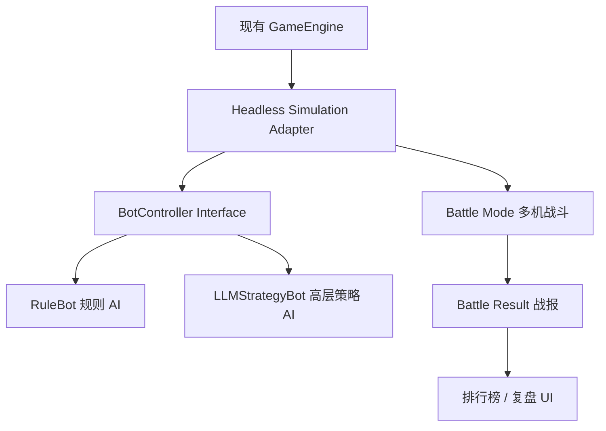
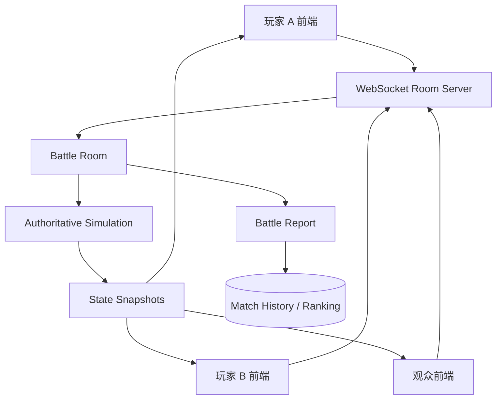
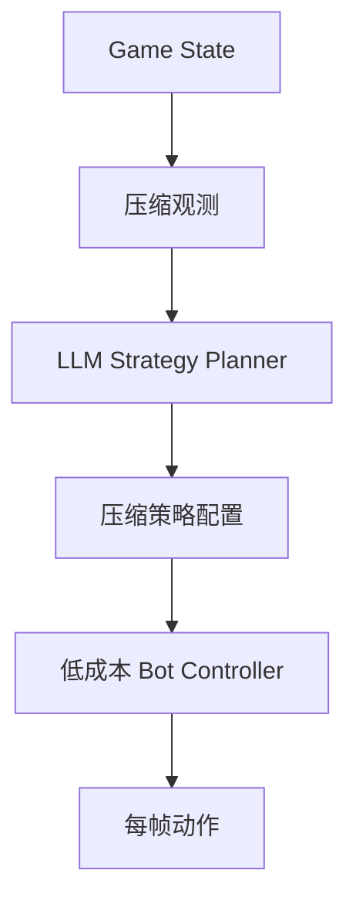

# Storm Blaster AI Battle Arena Taskbook

Source: https://chatgpt.com/share/6a1917eb-3418-83ea-bda6-c492ed0d497b
Extracted: 2026-05-29

This file preserves the task plan and reusable prompts from the shared conversation as project reference material.
Model names and external-tool claims from the source are retained as planning guidance; adapt them to the currently available Codex tools and models before execution.

## Active Working Constraints Extracted For Codex

- Treat this repository as a React + TypeScript + Vite canvas shooter named Storm Blaster.
- Preserve existing single-player level mode and endless mode while adding AI Battle Arena behavior incrementally.
- Prefer additive modules and typed interfaces over broad rewrites of the game engine.
- Do not call external LLM APIs in the first local battle milestone; use deterministic local bots first.
- Keep the runtime architecture cheap: high-level strategy may output compressed policy, but frame-level control must stay local and deterministic.
- Avoid real-money betting, gambling, payments, or client-trusted winner/score logic.
- After TypeScript or React changes, run `npm run build`; run `npm run lint` as an additional check when practical.

---
下面这套不要直接让一个 Agent 全做。你的项目现在是 **React + TypeScript + Vite**，`package.json` 里已有 `vite / build / lint` 脚本，主入口是 `src/App.tsx -> src/pages/Home.tsx`，游戏核心在 `src/game/engine.ts`。
目前它本质是一个 **单人 Canvas 飞机射击游戏**：`GameEngine` 内部管理玩家、敌人、子弹、掉落物、分数、关卡、无尽模式等状态。 现有输入接口是 `handleTouchStart / handleTouchMove / handleTouchEnd`，这正好可以被 AI 控制器接管。

Codex 官方支持并行子 Agent：可以显式要求 Codex 生成多个 subagent，并汇总结果；也支持用不同模型和自定义 agent 配置。 官方也建议用 `AGENTS.md` 给 Codex 固化项目规范，避免每次重复解释代码结构。

---

# 一、项目总任务书：Storm Blaster AI Battle Arena

## 0. 项目目标

把现有《雷霆战机》复刻项目改造成：

> **多人在线 AI 飞机斗蛐蛐竞技场**
> 玩家不直接操作飞机，而是选择 / 训练 / 配置 AI 驾驶员，让多个 AI 战机在同一战场中自动战斗。观众可以观看、比较、复盘不同 AI 的策略表现。

核心不是“人打飞机”，而是：

```text
AI 飞机人格 / 策略配置
        ↓
实时战斗模拟
        ↓
多人观战 / 对局房间
        ↓
排行榜、战报、策略分析
```

---

# 二、推荐架构

## 阶段 1：先做本地 AI 斗蛐蛐，不急着联网

目标：先让多个 AI 飞机在本地同屏自动战斗。



关键改造：

| 模块 | 任务 |
|---|---|
| `GameEngine` | 从单玩家逻辑拆出可复用模拟核心 |
| `Player` | 扩展为 `Fighter`，支持多个 AI 战机 |
| `InputState` | 从单输入变为每个战机独立输入 |
| `BotController` | 每帧或每 N 帧输出移动目标、规避、攻击偏好 |
| `BattleMode` | 新增 AI 对战模式 |
| `BattleReport` | 输出胜者、击杀数、存活时间、伤害、规避率等 |

---

## 阶段 2：接入多人在线房间

目标：玩家可以进入房间，选择 AI 驾驶员，看 AI 战斗。



建议技术：

| 层 | 技术建议 |
|---|---|
| 前端 | 继续 React + Canvas |
| 实时通信 | WebSocket / Socket.IO |
| 服务端 | Node.js + TypeScript |
| 状态同步 | Server authoritative，客户端只渲染 |
| 数据库 | 初期用 JSON / SQLite，后续 Supabase / PostgreSQL |
| 部署 | Vercel 前端 + Railway / Render / Fly.io 后端 |

---

## 阶段 3：引入真正的 LLM 多模型策略系统

不要让 LLM 每帧控制飞机。那会烧 token，而且延迟不可控。

正确结构：



LLM 只做高层策略：

```json
{
  "personality": "aggressive",
  "risk": 0.75,
  "targetPriority": "low_hp_enemy",
  "dodgeStyle": "wide_arc",
  "powerupPriority": ["shield", "rage", "missile"],
  "formation": "edge_kite"
}
```

低层移动仍由规则系统执行：

```ts
interface BotAction {
  targetX: number;
  targetY: number;
  fireMode: 'auto';
  dodgeWeight: number;
  collectWeight: number;
  targetEnemyId?: number;
}
```

这样 token 成本最低。

---

# 三、Codex 多 Agent 分工策略

## 模型分配

根据 Codex 官方模型说明，`gpt-5.5` 适合复杂编码、研究和大型工程任务；`gpt-5.4-mini` 适合更快、更便宜的轻量编码和子 Agent；`gpt-5.3-codex-spark` 偏实时迭代，但目前是 Pro 研究预览。

建议：

| Agent | 模型 | 原因 |
|---|---|---|
| 总控架构 Agent | `gpt-5.5` | 负责全局拆解、冲突合并 |
| 引擎重构 Agent | `gpt-5.5` | 涉及核心游戏状态，风险高 |
| Bot AI Agent | `gpt-5.4-mini` 起步，复杂时升 `gpt-5.5` | 先做规则 AI，不浪费大模型 |
| 联机后端 Agent | `gpt-5.5` | 网络同步、房间状态、竞态问题复杂 |
| UI/交互 Agent | `gpt-5.4-mini` | 页面、按钮、战报、观战 UI 可用小模型 |
| 测试/平衡 Agent | `gpt-5.4-mini` | 批量写测试、模拟脚本 |
| 审查 Agent | `gpt-5.5` | 最后查架构、类型、安全和同步问题 |

---

# 四、建议新建的目录结构

让 Codex 按这个目标改：

```text
src/
  game/
    engine.ts
    types.ts
    entities.ts
    renderer.ts
    levels.ts

    battle/
      battleTypes.ts
      battleEngine.ts
      battleReport.ts
      simulationConfig.ts

    bots/
      BotController.ts
      RuleBot.ts
      AggressiveBot.ts
      DefensiveBot.ts
      CollectorBot.ts
      LLMStrategyBot.ts
      observation.ts
      policy.ts

    multiplayer/
      protocol.ts
      roomTypes.ts

  pages/
    Home.tsx
    BattleArena.tsx
    BattleRoom.tsx
    MatchReport.tsx

server/
  index.ts
  rooms/
    RoomManager.ts
    BattleRoom.ts
  protocol/
    messages.ts

.codex/
  agents/
    architect.toml
    engine-worker.toml
    bot-worker.toml
    backend-worker.toml
    ui-worker.toml
    qa-reviewer.toml

AGENTS.md
```

---

# 五、给 Codex 的总控提示词

下面这一段可以直接复制给 Codex。建议用 `gpt-5.5` 开总控。

```text
You are the lead engineering coordinator for this repository.

Project goal:
Transform the current Storm Blaster single-player React + TypeScript + Vite canvas shooter into an AI Battle Arena inspired by classic 雷霆战机 / vertical shoot-em-up mechanics. The new mode should let multiple AI-controlled fighters battle automatically in a "digital cricket fighting" style arena. Human users mainly configure, watch, compare, and review AI fighters rather than directly controlling the plane.

Important constraints:
- Preserve the existing single-player level and endless modes unless a refactor requires minimal safe changes.
- Do not rewrite the whole project from scratch.
- Prefer incremental, typed, reviewable patches.
- Keep the project buildable with `npm run build`.
- Use TypeScript interfaces for all new game protocols, bot actions, battle reports, and multiplayer messages.
- Do not add heavy dependencies without strong justification.
- If backend work is too large, scaffold a minimal Node/TypeScript WebSocket server and clearly document the next step.
- The first milestone must work locally without any external LLM API call.

Existing code assumptions:
- The app is React + TypeScript + Vite.
- Main UI is in `src/pages/Home.tsx`.
- Core game engine is in `src/game/engine.ts`.
- Core types are in `src/game/types.ts`.
- Current GameEngine controls one player through touch/mouse input and exposes methods such as `handleTouchStart`, `handleTouchMove`, `handleTouchEnd`, `getState`, `pause`, `resume`, and `stop`.

Spawn specialized subagents in parallel, wait for all of them, then consolidate their results into one implementation plan and apply the safest first milestone.

Spawn these subagents:

1. explorer-architecture
Model: gpt-5.4-mini
Task: Read the repository structure and summarize the minimum refactor needed to support AI-controlled fighters without breaking current gameplay. Do not edit files. Return a file-by-file risk map.

2. engine-worker
Model: gpt-5.5
Task: Design and implement the minimal engine abstraction needed for AI control. Add a BotController interface and a local battle mode that can run at least two AI-controlled fighters. Preserve current single-player mode. Prefer small additive files under `src/game/bots` and `src/game/battle`.

3. bot-worker
Model: gpt-5.4-mini
Task: Implement cheap deterministic rule-based bots: AggressiveBot, DefensiveBot, CollectorBot. They should operate on compressed observations and output target positions/actions. Do not use external APIs. Add simple comments explaining their behavior.

4. ui-worker
Model: gpt-5.4-mini
Task: Add a minimal Battle Arena UI route or menu entry. The user should be able to start an AI battle, view fighter names/types, see live stats, and see a match result summary. Keep visual style consistent with the existing neon sci-fi interface.

5. backend-scout
Model: gpt-5.4-mini
Task: Do not implement full networking yet. Produce a typed protocol proposal under `src/game/multiplayer/protocol.ts` for future WebSocket multiplayer rooms: create room, join room, select bot, start match, state snapshot, match report, error. Include comments.

6. qa-reviewer
Model: gpt-5.5
Task: After the other agents finish, review the changed files for type errors, architectural risks, broken existing gameplay, runaway loops, and avoidable token/API waste. Run `npm run build` and, if available, `npm run lint`. Fix only blocking issues.

Execution policy:
- First run repository inspection commands.
- Then allow each subagent to work in its own area.
- Avoid two agents editing the same file at the same time. If unavoidable, the lead coordinator must merge manually.
- Implement Milestone 1 only:
  A. Local AI battle mode.
  B. Rule-based AI bots.
  C. Minimal battle UI.
  D. Typed protocol stub for future online mode.
  E. Build passes.
- Do not implement real-money betting, payments, or gambling mechanics.
- Do not call external LLM APIs in runtime code for Milestone 1.
- At the end, summarize:
  1. What changed.
  2. Files edited.
  3. How to run.
  4. What remains for Milestone 2 multiplayer.
  5. Any known limitations.
```

---

# 六、`AGENTS.md` 建议内容

在仓库根目录新建 `AGENTS.md`。Codex 会自动读取它，减少每次提示词长度。官方说明 Codex 会从全局和项目目录读取 `AGENTS.md`，并按目录层级合并指令。

```md
# AGENTS.md

## Project identity

This repository is Storm Blaster, a React + TypeScript + Vite canvas shoot-em-up game.

The long-term product direction is:
- Preserve the existing vertical shooter feel.
- Add an AI Battle Arena mode where AI-controlled fighters compete automatically.
- Human users configure, spectate, compare, and review AI fighters.
- The design metaphor is "digital cricket fighting", but do not implement real-money betting or gambling mechanics.

## Current architecture assumptions

Important files:
- `src/App.tsx`: root app component.
- `src/pages/Home.tsx`: current main screen, menus, canvas lifecycle, and input forwarding.
- `src/game/engine.ts`: current single-player game engine.
- `src/game/types.ts`: game entities, player, enemy, bullet, collectible, and game state types.
- `src/game/renderer.ts`: canvas rendering.
- `src/game/entities.ts`: entity creation.
- `src/game/levels.ts`: level configuration.
- `src/game/audio.ts`: audio manager.

## Engineering rules

- Do not rewrite the project from scratch.
- Preserve current single-player level mode and endless mode.
- Prefer additive modules over invasive edits.
- Use TypeScript types for new systems.
- Keep runtime AI cheap and deterministic first.
- Do not call external LLM APIs in the first local battle milestone.
- Do not add heavy dependencies unless there is no simple alternative.
- Do not introduce real-money wagering, gambling, or payments.

## Commands

After changing TypeScript or React code, run:

```bash
npm run build
```

If linting is configured and dependencies are installed, also run:

```bash
npm run lint
```

## AI battle design rules

LLM models should not control the plane every frame.

Correct architecture:
1. LLM or high-level strategy layer outputs a compressed policy occasionally.
2. Cheap local BotController converts policy + game observation into frame-level actions.
3. Game engine executes deterministic actions.
4. Match result is summarized into a BattleReport.

For Milestone 1, only implement local rule-based bots:
- AggressiveBot
- DefensiveBot
- CollectorBot

## Multiplayer design rules

For online play, prefer server-authoritative simulation:
- Clients send room commands and bot selections.
- Server runs or coordinates the match.
- Clients receive snapshots and render.
- Match reports are generated from authoritative state.

Do not trust client-reported scores or winners.
```

---

# 七、`.codex/agents` 自定义 Agent 配置

Codex 支持在 `.codex/agents/` 里放项目级自定义 Agent TOML 文件；每个文件至少需要 `name`、`description`、`developer_instructions`，也可以指定 `model`。

## `.codex/agents/engine-worker.toml`

```toml
name = "engine-worker"
description = "Refactors the game engine and adds safe battle simulation abstractions."
model = "gpt-5.5"
model_reasoning_effort = "high"

developer_instructions = """
You work on the core game engine. Prioritize correctness and minimal invasive changes.

Rules:
- Preserve existing single-player gameplay.
- Add typed abstractions instead of rewriting engine.ts wholesale.
- Avoid changing renderer unless necessary.
- Build local AI battle support incrementally.
- Keep all new battle and bot types explicit.
- Do not add external LLM API calls.
- Run npm run build after changes.
"""
```

## `.codex/agents/bot-worker.toml`

```toml
name = "bot-worker"
description = "Implements low-cost deterministic AI bot controllers."
model = "gpt-5.4-mini"
model_reasoning_effort = "medium"

developer_instructions = """
You implement local rule-based bots for the AI Battle Arena.

Implement:
- BotController interface.
- Compressed battle observation type.
- AggressiveBot.
- DefensiveBot.
- CollectorBot.

Rules:
- No external APIs.
- No LLM calls.
- No per-frame expensive computation.
- Bots should output simple target positions and tactical weights.
- Prefer deterministic behavior where possible.
"""
```

## `.codex/agents/ui-worker.toml`

```toml
name = "ui-worker"
description = "Builds Battle Arena UI, menus, match result panels, and spectator screens."
model = "gpt-5.4-mini"
model_reasoning_effort = "medium"

developer_instructions = """
You work on React UI only.

Goals:
- Add an AI Battle Arena entry point.
- Let users start a local AI battle.
- Show fighter names, bot types, live score/lives/kills, and final match report.
- Keep the neon sci-fi visual style of the existing menu.
- Avoid touching core engine logic unless absolutely necessary.
"""
```

## `.codex/agents/backend-worker.toml`

```toml
name = "backend-worker"
description = "Designs multiplayer room protocol and future WebSocket backend."
model = "gpt-5.4-mini"
model_reasoning_effort = "medium"

developer_instructions = """
You design multiplayer architecture.

For the current milestone:
- Do not build a full production backend.
- Add typed protocol definitions for future WebSocket rooms.
- Define messages for create room, join room, select bot, start match, snapshot, match report, and error.
- Assume future server-authoritative simulation.
- Do not introduce client-trusted scoring.
"""
```

## `.codex/agents/qa-reviewer.toml`

```toml
name = "qa-reviewer"
description = "Reviews type safety, build failures, architecture risks, and gameplay regressions."
model = "gpt-5.5"
model_reasoning_effort = "high"

developer_instructions = """
You are the final reviewer.

Check:
- TypeScript errors.
- npm run build.
- Existing single-player mode still works.
- Battle mode does not create runaway loops.
- No external API calls were added.
- No gambling/payment mechanics were added.
- New files have clear types and minimal coupling.

Fix only blocking issues.
Summarize remaining risks.
"""
```

---

# 八、第一阶段 Codex 任务：只做本地 AI 对战

这是最稳的第一条任务。不要一上来就做联网。

```text
Implement Milestone 1: Local AI Battle Arena.

Goal:
Add a local AI-vs-AI battle mode to the existing Storm Blaster game.

Scope:
1. Add a typed BotController system under `src/game/bots`.
2. Add at least three deterministic bots:
   - AggressiveBot: prioritizes attacking nearest or weakest enemy.
   - DefensiveBot: prioritizes survival, dodging bullets, and staying near safe zones.
   - CollectorBot: prioritizes powerups and score items while avoiding lethal danger.
3. Add a local battle simulation layer under `src/game/battle`.
4. Add a minimal Battle Arena UI:
   - Entry button from main menu.
   - Start battle button.
   - Display participating AI fighters.
   - Display live stats: HP/lives, score, kills, survival time.
   - Display final match report.
5. Keep existing START and ENDLESS modes working.
6. Add a future multiplayer protocol stub under `src/game/multiplayer/protocol.ts`.

Constraints:
- No external API calls.
- No LLM runtime dependency.
- No backend yet.
- No gambling or real-money betting.
- Do not rewrite the whole GameEngine.
- Run `npm run build` before final response.

Use subagents:
- engine-worker for battle simulation and engine integration.
- bot-worker for bots.
- ui-worker for Battle Arena UI.
- backend-worker only for protocol types.
- qa-reviewer for final build/type review.

Return:
- Summary of files changed.
- How to run.
- Known limitations.
- Next milestone recommendation.
```

---

# 九、第二阶段 Codex 任务：多人在线房间

等本地 AI Battle 可跑后，再投这个。

```text
Implement Milestone 2: Multiplayer Spectator Rooms.

Goal:
Add a minimal online room system for AI Battle Arena.

Architecture:
- Server-authoritative room state.
- Clients select bot profiles and spectate.
- Server emits state snapshots.
- Clients render snapshots.
- Match result is generated by authoritative server logic.

Scope:
1. Create a minimal Node + TypeScript WebSocket server under `server/`.
2. Add RoomManager and BattleRoom classes.
3. Use typed messages from `src/game/multiplayer/protocol.ts`.
4. Add frontend room UI:
   - Create room.
   - Join room by code.
   - Select bot.
   - Ready state.
   - Watch battle.
   - Show final report.
5. Add local development scripts if necessary:
   - `npm run dev`
   - `npm run dev:server`
   - `npm run dev:all` if practical.

Constraints:
- Keep implementation minimal.
- No account system yet.
- No database yet unless needed.
- No real-money betting.
- Do not trust client-reported winners or scores.
- Run build and document how to test locally.

Use subagents:
- backend-worker: server and room protocol.
- ui-worker: frontend room UI.
- engine-worker: simulation integration if needed.
- qa-reviewer: final build and risk review.
```

---

# 十、第三阶段 Codex 任务：LLM 策略层

这个阶段才引入大模型。重点：**低频调用、压缩状态、策略缓存**。

```text
Implement Milestone 3: Optional LLM Strategy Layer.

Goal:
Add an optional high-level LLM strategy planner for AI fighters without using LLMs for per-frame control.

Architecture:
- Rule-based bots remain the default.
- LLM planner receives compressed observations only.
- LLM planner outputs a compact BotPolicy.
- BotController uses BotPolicy for local per-frame decisions.
- Strategy updates happen at low frequency, e.g. match start, phase change, or every 10-20 seconds.
- Add a mock provider first, then a provider interface for real APIs later.

Scope:
1. Add `BotPolicy` type.
2. Add `CompressedObservation` type.
3. Add `StrategyPlanner` interface.
4. Add `MockStrategyPlanner`.
5. Add `LLMStrategyBot` that can consume a policy but does not require live API.
6. Add token budget safeguards:
   - never send full GameState;
   - never send canvas/image data;
   - never call per frame;
   - cache strategy until meaningful state transition.
7. Add documentation explaining how to connect a real LLM later.

Constraints:
- Do not commit API keys.
- Do not hardcode provider credentials.
- Runtime must work without external API.
- Build must pass.
```

---

# 十一、推荐你实际采用的开发顺序

## 最合理顺序

```text
1. AGENTS.md
2. .codex/agents/*.toml
3. Milestone 1：本地 AI Battle
4. Milestone 2：WebSocket 房间
5. Milestone 3：LLM 策略层
6. Milestone 4：排行榜 / 复盘 / AI 训练日志
```

不要反过来。
如果先做联网和 LLM，很容易变成“网络、状态同步、模型调用、游戏规则”四件事同时爆炸。

---

# 十二、核心设计判断

你的项目最有价值的方向不是简单“多人联机雷霆战机”，而是：

> **AI 战机人格化 + 策略差异 + 可观看的自动竞技。**

所以第一版不要追求复杂模型。先做三个能看出差异的 Bot：

| Bot | 观感 |
|---|---|
| AggressiveBot | 冲、贴脸、击杀高、死亡快 |
| DefensiveBot | 苟、绕弹、存活久 |
| CollectorBot | 抢道具、发育、后期强 |

这样“电子斗蛐蛐”的观看性会先成立。然后再把 LLM 作为“教练 / 策略人格生成器”，而不是“每帧驾驶员”。这才是省 token 的正确架构。
